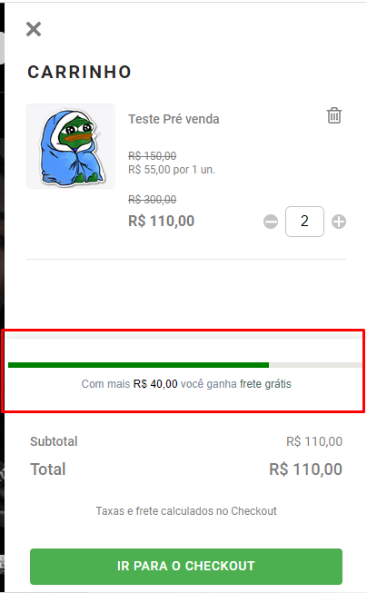
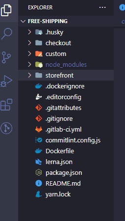
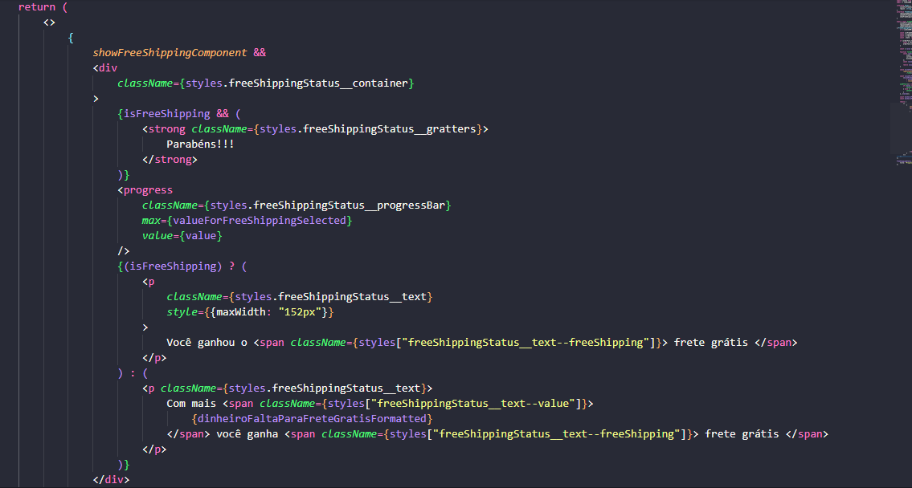

# Minicart Free Shipping

&nbsp;

O componente Minicart Free Shipping fornece uma barra de progresso no minicart responsável por mostrar o valor necessário à ser atingido para obter frete grátis na loja:

- Definir se o bloco aparecerá ou não.
- Escolher o valor do frete grátis padrão.
- Definir as regiões e seus respectivos valores para frete grátis

&nbsp;

## Explicação em vídeo:

---

Existe uma explicação de vídeo para esse componente, você pode acessá-la [clicando aqui](https://youtu.be/Yzs0ZEaYLcQ).

## Aparência:

---

&nbsp;

## Configuração:

---

- Este projeto faz uso do "vtex.order-manager" e do "vtex-render-runtime", portanto, certifique-se de que ambos foram instalados, para instalá-los, adicione-os como dependência em seu "manifest.json", localizado na pasta custom e rode yarn | npm install em seu terminal.
- Para utilizar este componente em seu projeto será necessário que você faça o download desse diretório e adicione ele dentro da pasta components, localizada em "/custom/react/components".

&nbsp;

&nbsp;

- Após isso será necessário criar um arquivo de exportação, dentro da raiz da pasta react, dessa forma:

&nbsp;

&nbsp;

- Para utilizar este componente dentro do storefront, você precisa declará-lo, para fazer isso será necessário criar uma interface e criar um contentSchema.

  - Para criar uma interface, basta criar um schema dentro do arquivo "interfaces.json", localizado em "custom/store". Veja o Exemplo Abaixo:

&nbsp;

&nbsp;

- Para definir os contentSchema, basta criar os seguintes Schemas no arquivo "contentSchemas.json" localizado em "custom/store". Veja o Exemplo Abaixo:

&nbsp;

&nbsp;

&nbsp;

## Utilizando dentro do Storefront:

---

- Com o seu componente declarado, agora ele está pronto para uso. Para utilizar este componente, basta chamar ele como um block no "flex-layout.col#minicart-footer" do minicart, veja o Exemplo Abaixo:

  &nbsp;
  
  &nbsp;

&nbsp;

## Props:

---

| Block name     | Description                                                                                                 |
| -------------- | ----------------------------------------------------------------------------------------------------------- |
| "free-shipping" | Recebe um objeto de props, denominado "props", onde é possível configurar ["showFreeShippingComponent", "valueForFreeShipping", "regionsAndValueToFreeShipping"] |

&nbsp;

| Props          | Type   | Description                                                                         |
| -------------- | ------ | ----------------------------------------------------------------------------------- |
| "showFreeShippingComponent" | boolean | Recebe um valor booleano se deve mostrar o componente ou não. |
| "valueForFreeShipping"      | string  | Recebe um valor em string que significa o valor padrão para ter direito ao frete grátis.|
| "regionsAndValueToFreeShipping"    | array | Recebe um array de objetos que definem uma região com seu respectivo valor de frete grátis. ["region", "valueForFreeShipping"]|

&nbsp;

| Props name      | Recebe um array de objetos que se referem à região e seu respectivo valor para frete grátis                 |
| --------------  | ----------------------------------------------------------------------------------------------------------- |
| "free-shipping" | Recebe um objeto de props, denominado "props", onde é possível configurar ["showFreeShippingComponent", "valueForFreeShipping", "regionsAndValueToFreeShipping"] |

&nbsp;

| Props          | Type   | Description                                                                         |
| -------------- | ------ | ----------------------------------------------------------------------------------- |
| "region" | string | Recebe uma string referente ao estado. (ex: SP) |
| "valueForFreeShipping" | string | Recebe um valor em string que significa o valor padrão para ter direito ao frete grátis. |

&nbsp;

## Customização:

- Para customizar a barra de frete grátis e os textos é necessário alterar dentro do componente react, como no exemplo abaixo:

&nbsp;

&nbsp;

- E para alterar o estilo, basta fazer alterações no arquivo styles.css do componente.
